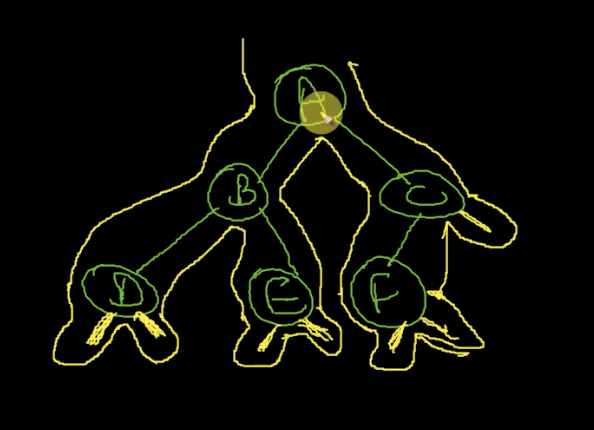
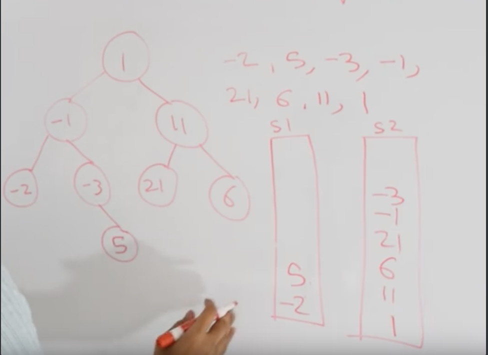

 

Title : Preorder , Inorder and PostOrder Traversals
Date : Sep 24, 2020 7:32:42 PM
Tags:  #PreOrder #Inorder #PostOrder
External Link : 
 
# Traversals

## Visualize the tree

Trick 
        - Preorder = Visit for the first time
        - Inorder = Visit for the second time
        - Postorder = Visit when both left and right side are traversed.


In the above case 
* PreOrder  = A,B,D,E,F,C
* In order = D,B,E,A,F,C
* Post order  = D,E,B,F,C,A


Draw small branches when a node of the tree  is **null** 



## PreOrder Traversal

This is also a variation of [[DFS]]. Where we 

```python
def preorderTraversal(self, root: TreeNode) -> List[int]:
        result = []
        if root is None:
            return
        stack = deque([root])
        while len(stack) > 0:
            item = stack.pop()
            result.append(item.val)
            if item.right is not None:
                stack.append(item.right)
            if item.left is not None:
                stack.append(item.left)
        return result

```

## InOrder Traversal

```python
def inorderTraversal(self, root: TreeNode) -> List[int]:
        if root is None:
            return None
        stack = deque([])
        current  = root
        result = []
        while len(stack) != 0 or current is not None:
            while current is not None:
                stack.append(current)
                current = current.left
            current = stack.pop()
            result.append(current.val);
            current = current.right
        return result

```

## Post Order - Iterative




```python
def post_order(root):
    result = []
    if root is None:
        return
    stack1 = deque([root])
    stack2 = deque()
    while len(stack1) > 0:
        root = stack1.pop()
        stack2.append(root)
        if root.left is not None:
            stack1.append(root.left)
        if root.right is not None:
            stack1.append(root.right)
    while len(stack2) > 0:
        root = stack2.pop()
        result.append(root)

    return result

```

   def postorderTraversal(self, root: Optional[TreeNode]) -> List[int]:
        result = []
        if root is None:
            return result
        stack = []
        stack.append(root)
        while len(stack) > 0 :
            curr = stack.pop()
            result.append(curr.val)
            if curr.left is not None:
                stack.append(root.left)
            if curr.right is not None:
                stack.append(root.right)
        return list

## Level Order - Recursive

```python
 def levelOrder(self, root: TreeNode) -> List[List[int]]:
        level_store = []
        if not root:
            return level_store
       
        def helper(node,level):
            if len(level_store) == level:
                level_store.append([])
            level_store[level].append(node.val)
            if node.left is not None:
                helper(node.left,level+1)
            if node.right is not None:
                helper(node.right,level+1)
        
        helper(root,0)
        return level_store

```

## Other Problems:
1. Validate if a tree is [[BST]]